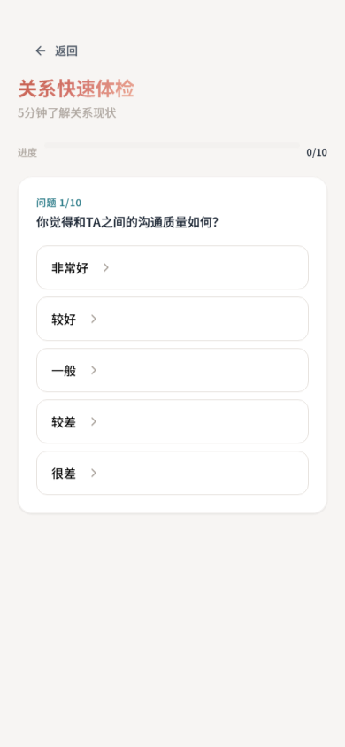
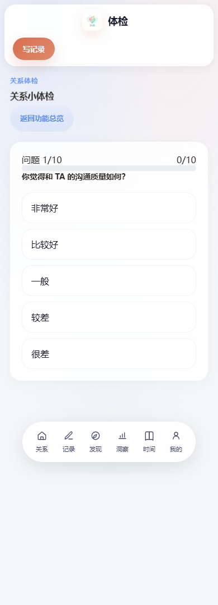
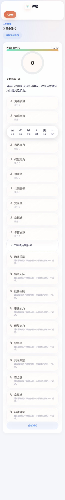
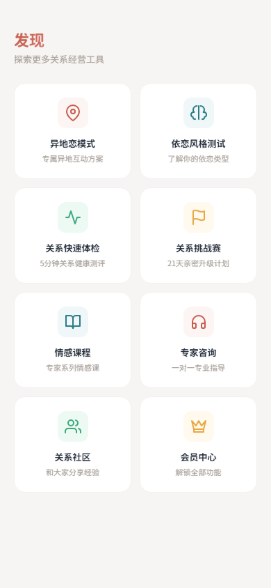
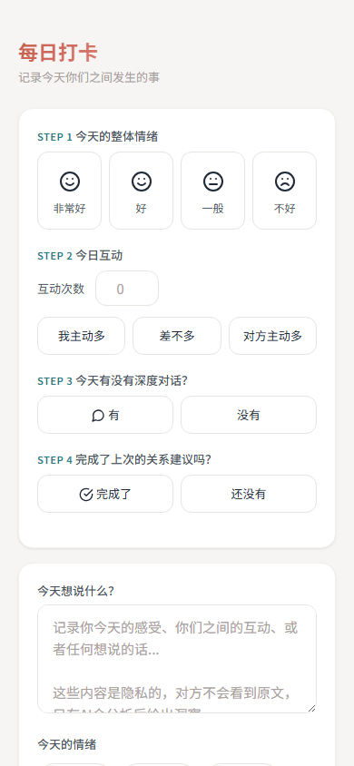

# 亲健 · 青年亲密关系健康管理平台

> "让爱有据可循" —— 基于微信小程序的亲密关系数字化管理工具

---

## 📱 项目截图

### 首页与核心功能

| 首页 | 打卡页 | 报告页 |
|:---:|:---:|:---:|
|  |  |  |

### 配对与认证

| 登录页 | 注册页 | 配对管理 |
|:---:|:---:|:---:|
|  |  |  |

### 发现页功能

| 发现首页 | 异地恋 | 挑战赛 |
|:---:|:---:|:---:|
|  |  |  |

| 社区 | 课程 | 专家咨询 |
|:---:|:---:|:---:|
|  |  |  |

| 会员中心 |
|:---:|
|  |

### 关系健康测试

| 测试入口 | 开始测试 | 测试题目 | 测试结果 |
|:---:|:---:|:---:|:---:|
|  |  |  |  |

### 调试模式

| 发现页调试 | 打卡页调试 |
|:---:|:---:|
|  |  |

---

## ✨ 核心功能

### 1. 关系健康打卡系统
- **四步打卡流程**：心情评分 → 互动频率 → 深度对话 → 任务完成
- 支持文字、图片、语音记录
- 情绪标签追踪（感恩、甜蜜、担忧等）
- 连续打卡天数统计

### 2. AI 智能报告
- **日报/周报/月报**：自动生成关系健康分析
- **健康评分**：基于打卡数据的量化评估
- **AI 洞察**：DeepSeek-V3 + Kimi K2.5 多模态分析
- **个性化建议**：针对性的关系改善方案

### 3. 配对管理系统
- **多配对支持**：情侣、夫妻、挚友多种关系类型
- **自定义备注名**：给伴侣设置专属昵称
- **配对码邀请**：6位数字绑定码快速配对
- **关系树成长**：游戏化互动增加趣味性

### 4. 登录与认证
- **邮箱登录**：传统账号密码方式
- **手机验证码**：快速登录，新号自动注册
- **微信一键登录**：wx.login 授权登录
- **自动登录/记住密码**：智能登录体验

### 5. 发现页功能矩阵
- **异地恋专区**：距离关系专属内容
- **依恋测试**：了解你的依恋类型
- **关系健康测试**：评估关系质量
- **社区交流**：用户分享与讨论
- **挑战赛**：双人任务挑战
- **课程学习**：亲密关系经营课程
- **专家咨询**：专业心理咨询服务
- **会员特权**：高级功能解锁

### 6. 危机预警系统
- **智能监测**：基于数据的关系风险识别
- **分级预警**：轻度/中度/重度三级预警
- **干预方案**：个性化危机处理建议
- **里程碑记录**：记录关系重要时刻

---

## 🛠 技术栈

| 层级 | 技术方案 |
|-----|---------|
| **前端** | 微信小程序原生开发 |
| **后端** | Python FastAPI + PostgreSQL |
| **AI** | 硅基流动 API（DeepSeek-V3 + Kimi K2.5） |
| **部署** | Docker Compose + Nginx |
| **监控** | 日志追踪 + 性能监控 |

---

## 🚀 快速部署

### 环境要求
- Docker & Docker Compose
- PostgreSQL 14+
- Python 3.12+

### 1. 克隆代码
```bash
git clone https://github.com/Tcim1129/qinjian.git
cd qinjian
```

### 2. 配置环境变量
```bash
cd backend
cp .env.example .env
# 编辑 .env 填入：
# - DATABASE_URL
# - SILICONFLOW_API_KEY
# - WECHAT_APPID（可选，用于微信登录）
# - WECHAT_SECRET（可选）
```

### 3. 启动服务
```bash
docker compose up -d --build
```

### 4. 数据库迁移
```bash
docker compose exec backend alembic upgrade head
```

---

## 📋 小程序配置

### 1. 导入项目
- 打开微信开发者工具
- 选择「导入项目」
- 项目目录选择 `miniprogram/`
- AppID 填入你的小程序 AppID

### 2. 配置服务器域名
登录[微信公众平台](https://mp.weixin.qq.com/) → 开发 → 开发设置 → 服务器域名：

```
request合法域名:
- https://你的域名.com
- https://tcb-api.tencentcloudapi.com（如使用云开发）
```

### 3. 修改接口地址
编辑 `miniprogram/app.js`：
```javascript
globalData: {
  baseUrl: 'https://你的域名.com/api/v1'
}
```

---

## 🔧 常用命令

```bash
# 查看服务状态
docker compose ps

# 查看后端日志
docker compose logs -f backend

# 重启服务
docker compose restart

# 更新代码后重新部署
git pull && docker compose up -d --build

# 进入数据库
docker compose exec db psql -U qinjian -d qinjian

# 数据库迁移
docker compose exec backend alembic revision --autogenerate -m "描述"
docker compose exec backend alembic upgrade head
```

---

## 📊 项目结构

```
qinjian/
├── miniprogram/          # 微信小程序前端
│   ├── pages/           # 页面文件
│   │   ├── home/        # 首页
│   │   ├── checkin/     # 打卡页
│   │   ├── report/      # 报告页
│   │   ├── pair/        # 配对管理
│   │   ├── login/       # 登录注册
│   │   └── discover/    # 发现页（8个子页面）
│   ├── utils/           # 工具函数
│   │   ├── api.js       # API 封装
│   │   └── auth.js      # 登录态管理
│   └── images/          # 图标资源
├── backend/             # FastAPI 后端
│   ├── app/
│   │   ├── api/v1/      # API 路由
│   │   ├── models/      # 数据库模型
│   │   ├── schemas/     # Pydantic 模型
│   │   └── services/    # 业务逻辑
│   └── alembic/         # 数据库迁移
├── screenshots/         # 项目截图
└── docker-compose.yml   # 部署配置
```

---

## 📝 更新日志

### v3.5 (2026-03-06)
- ✅ 新增：自定义伴侣备注名功能
- ✅ 新增：记住密码 & 自动登录
- ✅ 新增：已保存账号快速选择
- ✅ 新增：多配对切换管理
- ✅ 修复：危机预警 500 错误
- ✅ 优化：首页配对状态刷新逻辑

### v3.0 (2026-03-05)
- ✅ 新增：微信小程序完整功能
- ✅ 新增：单人模式（SOLO）
- ✅ 新增：微信一键登录
- ✅ 新增：手机号验证码登录
- ✅ 新增：8个发现子页面

---

## 🤝 贡献指南

欢迎提交 Issue 和 Pull Request！

---

## 📄 许可证

MIT License

---

<p align="center">
  <strong>亲健</strong> · 让爱有据可循
</p>
