# 摘要

亲健是一款面向青年亲密关系场景的 AI 健康管理平台，聚焦情侣、夫妻、挚友等真实关系中的沟通不足、情绪表达失衡、异地互动困难、冲突修复能力弱、关系状态难以持续追踪等问题，致力于通过数字化工具与人工智能能力，为用户提供低门槛、可持续、可视化的关系健康管理服务。

项目围绕“AI 增强真实关系”这一核心理念展开，构建了“每日打卡—关系分析—AI 报告—改善建议—长期追踪”的产品闭环。系统当前重点建设内容包括：用户认证与登录、关系配对、双视角打卡、AI 日报/周报/月报、关系树成长机制、危机预警、异地关系模块、依恋分析、关系健康测试、里程碑管理、课程与专家咨询入口等。平台现已形成“后端服务 + Web 工作台 + 微信小程序 + App 端”四部分协同推进的系统结构，项目正从概念方案阶段转向产品打磨与功能验证阶段。

从现实需求看，青年群体在亲密关系中普遍存在“高期待、低经营能力”的矛盾，而现有同类产品多偏社交娱乐、情侣互动工具或虚拟陪伴，缺少一套围绕真实关系管理、可日常使用、可持续记录、并具备 AI 辅助分析能力的产品。亲健的差异化路径在于：不替代真实关系，而是帮助用户更清楚地看见关系状态、理解关系节奏、识别潜在风险，并通过具体的小任务和趋势反馈支持关系改善。

从项目建设看，后端已基于 FastAPI 完成认证、配对、打卡、报告、关系树、危机预警、任务、异地活动、里程碑、社群提示、智能陪伴等模块接口；Web 端已形成关系健康工作台；微信小程序已搭建首页、打卡、发现、报告、我的及多个扩展页面；App 端基于 uni-app 已实现首页、打卡、报告、发现、个人中心等核心页面并持续联调优化。当前项目已具备较为完整的系统骨架和比赛展示基础。

本项目兼具社会服务价值、产品可行性和技术落地基础，适合在校园青年群体、关系服务场景和数字健康辅助场景中逐步验证与推广。未来，亲健将继续围绕关系健康管理这一核心方向，完善多端体验、优化 AI 输出质量、强化隐私边界和用户验证，逐步形成具有持续服务能力的青年关系健康数字平台。

**关键词：** 亲密关系、AI 健康管理、微信小程序、Web 工作台、App、多端协同、关系报告、危机预警、社会服务、电子商务

[TOC]

\newpage

# 一、项目概述

## 1.1 项目背景

当代青年在亲密关系中面临越来越明显的现实挑战。一方面，恋爱、婚姻、友谊等关系质量对个体幸福感的影响不断增强，青年群体对亲密关系的期待持续提高；另一方面，在学习压力、工作节奏加快、社交碎片化和异地生活方式影响下，很多年轻人并未建立起稳定的关系经营能力，导致沟通不足、冲突升级、情绪累积、联系变淡等问题频繁出现。

当前市面上的同类产品主要集中在三类：一是情侣互动工具，强调纪念日、空间、娱乐互动，但缺少深度分析；二是心理咨询平台，专业性较强但门槛较高、频次较低；三是 AI 陪伴应用，强调人机互动，却难以直接改善真实关系中的问题。在真实亲密关系管理这一细分场景中，缺少一套既能低门槛日常使用、又能提供趋势洞察与改善建议的工具型产品。

## 1.2 项目定位

亲健定位为**面向青年真实亲密关系场景的 AI 健康管理平台**。本项目强调三个原则：一是面向真实关系，而非虚拟陪伴关系；二是面向日常记录与长期追踪，而非一次性测试；三是面向辅助分析与改善建议，而非专业医疗诊断。

## 1.3 项目目标

1. 建设一套围绕真实关系经营的数字化平台；
2. 构建支持 Web、小程序、App 的多端产品形态；
3. 形成“打卡—分析—报告—改善—追踪”的核心功能闭环；
4. 在校园青年群体中验证产品价值与使用习惯；
5. 探索 AI 在关系健康辅助服务中的可持续应用模式。

## 1.4 项目当前状态

截至目前，项目已形成较为清晰的系统结构和开发成果：

- 已搭建后端 API 服务；
- 已搭建 Web 关系健康工作台；
- 已搭建微信小程序主路径页面；
- 已搭建 App 端核心页面；
- 已实现认证、配对、打卡、报告、关系树、危机预警等基础模块；
- 正在持续进行多端联调、体验优化和功能细化。

表 1-1 项目当前建设内容一览

| 建设层级 | 当前状态 | 说明 |
|---|---|---|
| 后端服务 | 已完成核心骨架 | 已具备认证、配对、打卡、报告等模块 |
| Web 端 | 已完成主要页面 | 可用于演示与桌面端体验 |
| 微信小程序 | 已完成主路径页面 | 首页、打卡、发现、报告、我的等已搭建 |
| App 端 | 已完成核心页面 | 基于 uni-app，正在持续联调优化 |
| 部署能力 | 已具备基础条件 | 已有 Docker Compose、Nginx、云部署配置 |

# 二、市场分析

## 2.1 用户需求分析

亲密关系问题具有高频、隐性、长期积累的特点。很多用户并非没有问题，而是难以判断问题何时开始、如何表达感受、怎样进行修复，也缺少一种可以帮助自己持续观察关系状态的工具。

从需求角度看，青年群体普遍存在以下共性需求：

- 需要一种低门槛方式记录关系状态；
- 需要看到关系变化趋势，而不是只依赖主观感受；
- 需要在问题扩大前得到提醒；
- 需要可执行、不过度说教的改善建议；
- 需要隐私可控的使用体验；
- 需要适应手机与碎片化场景的产品形态。

## 2.2 目标用户群体

表 2-1 目标用户群体细分

| 用户类型 | 典型场景 | 核心需求 |
|---|---|---|
| 情侣用户 | 日常互动、沟通不足、异地维护 | 打卡、趋势分析、异地辅助、改善建议 |
| 夫妻用户 | 沟通协调、长期陪伴、冲突修复 | 长期追踪、报告、危机提醒 |
| 挚友用户 | 联系减少、深度交流不足 | 关系维持、提醒、里程碑记录 |
| 单人体验用户 | 未绑定对象、先体验产品 | 自我记录、情绪整理、功能预览 |

## 2.3 同类产品分析

当前市场中与本项目相关的产品主要包括情侣互动工具、心理咨询平台与 AI 情感陪伴产品。情侣互动工具强调关系氛围，但缺少深度分析；心理咨询平台专业度较高，但使用门槛高；AI 情感陪伴产品注重虚拟陪伴，却难以直接作用于真实关系改善。

表 2-2 亲健与同类方向产品的对比

| 维度 | 情侣互动工具 | 心理咨询平台 | AI 情感陪伴 | 亲健 |
|---|---|---|---|---|
| 核心目标 | 氛围互动 | 专业咨询 | 虚拟陪伴 | 真实关系管理 |
| 使用频率 | 中高 | 低 | 中高 | 高 |
| 是否长期追踪 | 弱 | 弱 | 中 | 强 |
| 是否围绕真实关系改善 | 中 | 中 | 弱 | 强 |
| 是否适合多端轻量使用 | 中 | 中 | 中 | 强 |

## 2.4 项目切入点

亲健的切入点主要体现在以下几个方面：

1. 聚焦真实关系，而非泛社交；
2. 强调持续记录，而非单次测评；
3. 关注关系改善，而非情绪宣泄本身；
4. 推进多端协同，而非单端展示；
5. 将 AI 作为辅助工具，而非关系替代者。

# 三、产品与服务

## 3.1 产品核心理念

亲健的核心理念是：**AI 增强真实关系，而不是替代真实关系。**

项目不是希望让用户依赖 AI 建立虚拟情感，而是希望利用数字工具与分析能力，帮助用户更清楚地看见关系状态、理解彼此节奏、获得改善支持。

## 3.2 产品主路径

```text
登录注册 → 关系配对 → 每日打卡 → AI 分析 → 报告输出 → 改善建议 → 长期追踪
```

图 3-1 亲健产品核心服务闭环

## 3.3 核心功能模块

### 3.3.1 用户认证与登录

当前系统已支持邮箱注册与登录、手机号验证码登录、微信登录、用户资料获取与更新、密码修改等能力，兼顾不同终端和不同用户习惯下的快速接入。

### 3.3.2 关系配对

关系配对是亲健区别于普通单人记录工具的重要能力。当前支持创建配对、通过邀请码加入配对、查看当前关系摘要、解绑申请与确认、设置关系对象备注昵称。

### 3.3.3 每日打卡

每日打卡是系统的核心数据入口，当前支持心情与情绪状态记录、互动频率记录、深度交流情况记录、图片上传、语音上传、打卡历史查看和连续打卡统计。

### 3.3.4 AI 报告

报告系统是产品的核心输出能力，当前支持日报、周报、月报、最新报告查看、历史报告查看、趋势查看及当前报告生成触发。

### 3.3.5 关系树成长机制

关系树模块用于强化持续使用感和成长反馈感，当前支持查看关系树状态、浇水操作和成长阶段反馈。

### 3.3.6 危机预警机制

危机预警是亲健的重要辅助能力，当前支持当前危机状态查看、危机记录查看、提醒状态处理和风险资源推荐。

### 3.3.7 扩展模块

当前系统在“发现”模块中已逐步建设异地关系、依恋测试、关系健康测试、社群提示与通知、挑战赛、课程入口、专家咨询入口、会员中心、关系里程碑等扩展能力。

表 3-1 当前核心功能模块一览

| 模块 | 主要作用 | 当前状态 |
|---|---|---|
| 登录认证 | 建立账户与身份识别 | 已实现 |
| 关系配对 | 建立双人关系空间 | 已实现 |
| 每日打卡 | 收集关系状态数据 | 已实现 |
| AI 报告 | 形成趋势分析与建议 | 已实现 |
| 关系树 | 增强成长反馈 | 已实现 |
| 危机预警 | 识别异常状态 | 已实现 |
| 异地关系 | 支持异地互动场景 | 已接入 |
| 依恋测试 | 帮助理解互动模式 | 已接入 |
| 课程/专家/会员 | 服务化延展入口 | 已搭建入口 |

# 四、项目技术实现与系统介绍

## 4.1 系统总体架构

本项目采用“多前端 + 统一后端服务”的系统架构模式，整体结构如下：

```text
前端层
├── Web 关系健康工作台
├── 微信小程序端
└── App 端（uni-app）

业务服务层
├── 认证服务
├── 配对服务
├── 打卡服务
├── 报告服务
├── 关系树服务
├── 危机预警服务
├── 任务服务
├── 异地关系服务
├── 里程碑服务
├── 社群通知服务
└── 智能陪伴服务

数据层
├── PostgreSQL 数据库
├── 上传文件目录
└── 部署与运行环境
```

图 4-1 亲健系统总体架构图（建议替换为正式绘制图）

## 4.2 后端实现情况

后端基于 FastAPI 实现，已形成较完整的接口化业务结构。

表 4-1 后端模块与实现情况

| 模块 | 主要能力 |
|---|---|
| auth | 注册、登录、手机号登录、微信登录、修改资料、修改密码 |
| pairs | 创建配对、加入配对、关系摘要、解绑、昵称备注 |
| checkins | 打卡提交、今日打卡、历史打卡、连续天数 |
| reports | 生成日报、周报、月报，获取最新报告、历史报告、趋势 |
| upload | 图片上传、语音上传 |
| tree | 关系树状态、浇水成长 |
| crisis | 危机状态、危机记录、预警处理、资源推荐 |
| tasks | 每日任务、任务完成、依恋分析 |
| longdistance | 异地活动创建、完成、异地健康指数 |
| milestones | 里程碑创建、查看、回顾生成 |
| community | 经营提示、通知列表、已读处理 |
| agent | 智能陪伴会话、聊天记录、对话能力 |

## 4.3 Web 端实现情况

Web 端当前定位为“关系健康工作台”，主要特点包括：支持认证登录、支持首页/打卡/发现/报告/个人中心等主要页面、支持演示态与真实接口接入模式，适合展示与桌面端体验。

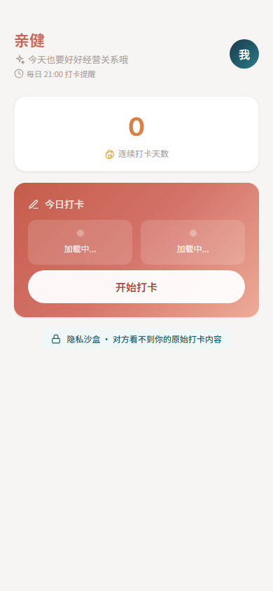

图 4-2 Web 端首页界面

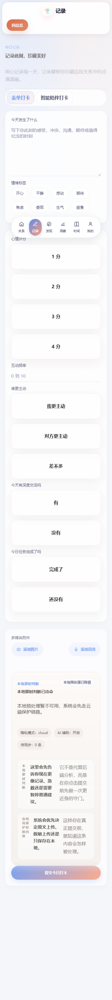

图 4-3 Web 端打卡界面

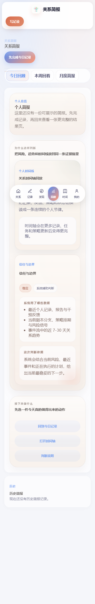

图 4-4 Web 端报告界面

## 4.4 微信小程序实现情况

微信小程序端当前已搭建较完整页面结构，主要包括首页、打卡页、发现页、报告页、我的页面、登录页、配对页、关系树页、危机页、里程碑页、异地页、依恋测试页、关系健康测试页、社区页、挑战赛页、课程页、专家页、会员页等。

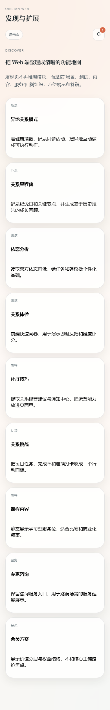

图 4-5 小程序发现页界面

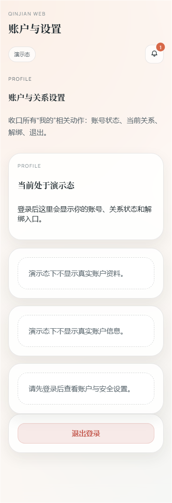

图 4-6 小程序个人中心界面

## 4.5 App 端实现情况

App 端基于 uni-app 构建，目前已实现首页关系状态展示、今日打卡入口、报告页日报/周报/月报切换、发现模块入口、个人中心入口和悬浮式导航。当前处于“功能骨架已搭建、交互细节与联调持续完善”的状态。

## 4.6 当前技术实现特点

当前项目技术实现具有以下三个特点：

- 多端并行推进；
- 接口驱动统一业务；
- 产品闭环逐步成型。

# 五、营销策略与推广路径

## 5.1 推广总体思路

考虑到项目当前仍处于产品打磨与验证阶段，推广策略更适合采用“轻量验证、场景传播、逐步扩展”的路径，而不是直接大规模投放。项目初期更关注产品是否真正解决用户问题，而非单纯追求曝光量。

## 5.2 初期推广路径

### 5.2.1 校园场景冷启动

校园场景是本项目当前最适合的验证环境，原因在于青年用户集中、情侣与挚友场景真实存在、熟人传播效率较高，也便于线下收集反馈。

### 5.2.2 关系测试引流

项目中的“关系健康测试”“依恋测试”等模块具有较强的轻量传播属性，适合作为首个体验入口，帮助用户从“好奇”过渡到“尝试使用”。

### 5.2.3 场景节日传播

项目可结合情人节、七夕、毕业季、开学季、心理健康主题活动周等节点开展传播。

表 5-1 当前适合的推广路径

| 推广方式 | 主要场景 | 目标 |
|---|---|---|
| 校园冷启动 | 班级群、宿舍、熟人链 | 获取种子用户 |
| 关系测试引流 | 小程序测试入口 | 降低首次体验门槛 |
| 节日传播 | 情人节、七夕、毕业季 | 提升话题传播度 |
| 校园活动合作 | 社团、心理活动周 | 提升真实触达 |

## 5.3 中期推广路径

在完成初步验证后，项目可探索与高校心理中心合作、校园讲座或体验活动试点、校园大使机制、小程序分享传播等方式逐步扩大影响力。

# 六、商业模式与财务规划

## 6.1 商业模式概述

考虑到当前项目仍处于开发与验证阶段，商业模式部分更适合采用“结构清晰、路径稳妥”的写法。项目当前可形成的商业模式主要包括三层：C 端订阅、增值服务和 B 端合作。

表 6-1 商业模式结构

| 层级 | 形式 | 主要内容 |
|---|---|---|
| C 端订阅 | 周报、月报、年度会员 | 面向个人用户的持续服务 |
| 增值服务 | 专家咨询、课程、深度测试 | 面向高需求用户的附加服务 |
| B 端合作 | 高校、青年服务、员工关怀合作 | 面向组织场景的拓展方向 |

## 6.2 当前阶段商业化原则

当前阶段应坚持以下原则：

1. 先验证产品价值，再逐步推动变现；
2. 先形成稳定主链路，再拓展服务层；
3. 先围绕真实需求提供帮助，再建立用户付费意愿。

## 6.3 阶段性财务规划思路

表 6-2 阶段性财务与目标思路

| 阶段 | 核心任务 | 重点投入 | 核心指标 |
|---|---|---|---|
| 产品验证期 | 完成系统打磨与校园试用 | 开发、部署、测试 | 注册量、配对率、活跃率 |
| 场景试点期 | 探索付费服务与试点合作 | 内容、活动、用户支持 | 报告使用率、复购率、付费率 |
| 合作拓展期 | 探索高校及青年服务合作 | 推广、服务、内容供给 | 合作数量、留存率、服务稳定性 |

# 七、风险管理与边界说明

## 7.1 项目边界

亲健的定位是“关系健康辅助工具”，而不是心理治疗系统、法律服务系统或医疗诊断系统。系统中的 AI 报告、提醒和建议应当被理解为辅助参考，而不能替代专业心理咨询、法律判断或医学诊断。

## 7.2 项目主要风险

### （1）隐私风险

项目涉及关系状态、情绪、图片、语音等敏感数据，因此隐私与权限边界必须持续强化。

### （2）AI 输出风险

AI 建议可能存在不准确、不完整或表达不当的问题，需要通过产品文案和边界提示加以控制。

### （3）多端联调风险

Web、小程序、App 三端同时推进，会增加接口联调、交互一致性和适配成本。

### （4）产品定位风险

如果功能过多、主线不清，用户容易在第一次使用时无法理解产品的核心价值。

表 7-1 主要风险与应对措施

| 风险类型 | 具体表现 | 应对措施 |
|---|---|---|
| 隐私风险 | 涉及情绪、语音、关系状态等敏感信息 | 强化权限控制与隐私说明 |
| AI 输出风险 | 报告或建议可能不准确 | 增加辅助性质说明与边界提示 |
| 多端联调风险 | 终端体验和接口状态不一致 | 优先打通主链路并分阶段联调 |
| 产品定位风险 | 功能过多导致主线分散 | 围绕“打卡—报告—改善”持续收敛 |

# 八、团队介绍与实施保障

## 8.1 团队情况说明

当前项目在技术实现层面主要由核心成员独立推进完成，涵盖后端、Web、小程序和 App 多端系统建设工作。团队其他成员则围绕项目文档、调研整理、展示准备、内容支持和项目协助等方面参与推进。

这一实际情况意味着：项目的技术路线、系统结构和产品实现保持了较高的一致性，但同时也对开发者的时间管理、优先级把控和迭代安排提出了更高要求。

## 8.2 团队分工

表 8-1 团队分工表

| 角色 | 姓名 | 主要职责 |
|---|---|---|
| 项目负责人 | 吴秀秀 | 统筹项目方向、比赛材料、汇报展示、项目推进 |
| 核心技术开发 | [请填写实际开发者姓名] | 后端、Web、小程序、App 的系统设计与开发 |
| 产品/文档协助 | 钟昊桐 | 功能整理、文档配合、材料支持 |
| 运营/内容协助 | 叶笙尧 | 展示准备、传播思路、活动支持 |
| 商务/调研协助 | 郑梓滢 | 市场调研、竞品整理、合作资料支持 |

> 注：若需在答辩中说明实际开发情况，可明确表述“当前技术开发工作主要由我一人承担，团队其他成员更多在文档、调研、展示和项目支持方面协同推进”。

## 8.3 团队优势

项目当前的主要优势并不在于团队人数，而在于：技术路线统一、产品理解集中、系统建设连续推进、多端形态已具备较完整骨架、项目已从纸面方案进入可演示、可持续迭代状态。

## 8.4 实施保障

为保障项目后续推进，团队将重点围绕以下方面展开：

- 按主链路优先级推进功能开发；
- 分清“已实现”“优化中”“规划中”；
- 保留清晰版本记录与测试记录；
- 优先保证比赛展示路径稳定；
- 持续补充截图、流程图与操作材料。

# 九、发展规划

## 9.1 短期规划

短期重点应围绕以下任务推进：

1. 打通登录—配对—打卡—报告主流程；
2. 完成 Web、小程序、App 三端联调；
3. 优化报告、关系树、危机预警等模块体验；
4. 补充比赛展示所需截图、图表与测试材料；
5. 完成稳定的答辩演示版本。

## 9.2 中期规划

中期计划包括优化异地关系与里程碑体验、强化智能陪伴式交互、完善课程与专家模块内容、收集真实用户反馈并迭代产品、提升 AI 报告的可读性与实用性。

## 9.3 长期规划

长期来看，亲健可继续围绕“青年关系健康管理”这一方向，逐步形成更成熟的关系管理工具体系、更丰富的内容和服务支持体系、更清晰的校园与社会服务场景落地路径，以及更稳定的多端数字健康产品平台。

# 十、结论

亲健项目面向青年亲密关系这一高频而长期被忽视的现实问题，尝试用 AI 与数字产品能力构建一套“可记录、可分析、可反馈、可持续”的关系健康管理平台。与泛社交工具、单次咨询服务或虚拟陪伴产品不同，亲健强调的是帮助用户更好地经营真实关系，而不是替代真实关系。

从当前项目进展来看，亲健已经具备较为完整的系统结构和产品雏形：后端服务已形成模块化接口体系，Web 工作台已可演示，小程序端已完成主要业务页面，App 端也已进入持续开发与联调阶段。项目已从“方案设想”逐步进入“系统实现与体验打磨”的关键时期。

综合社会价值、产品方向、技术基础与后续可扩展性来看，亲健具备较好的三创比赛项目基础。未来，只要继续围绕核心功能闭环、真实用户验证和多端体验优化进行打磨，并保持项目表述真实、清晰、稳妥，项目将具备更强的说服力与竞争力。

\newpage

# 附录 A 系统页面与功能展示说明

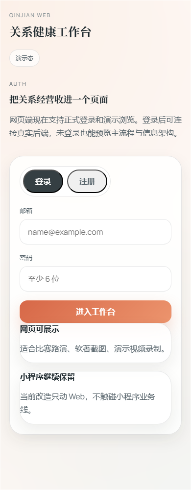

图 A-1 登录页

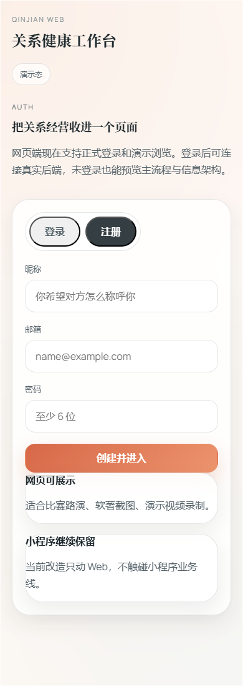

图 A-2 注册页

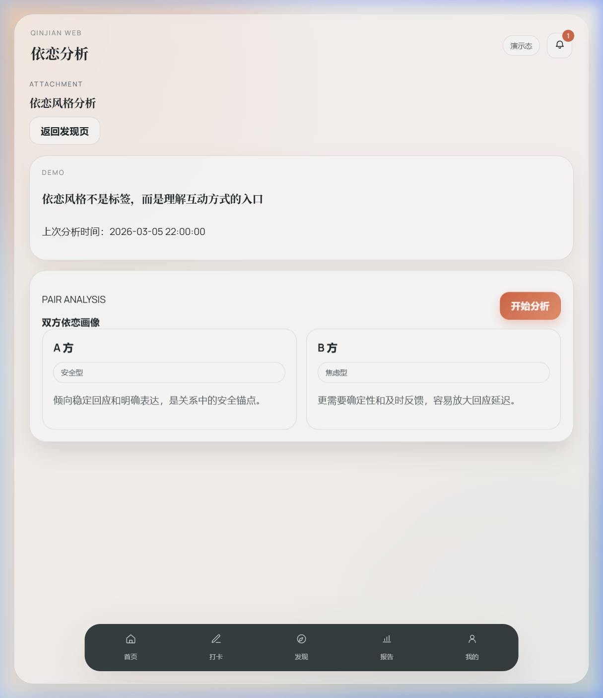

图 A-3 依恋测试页

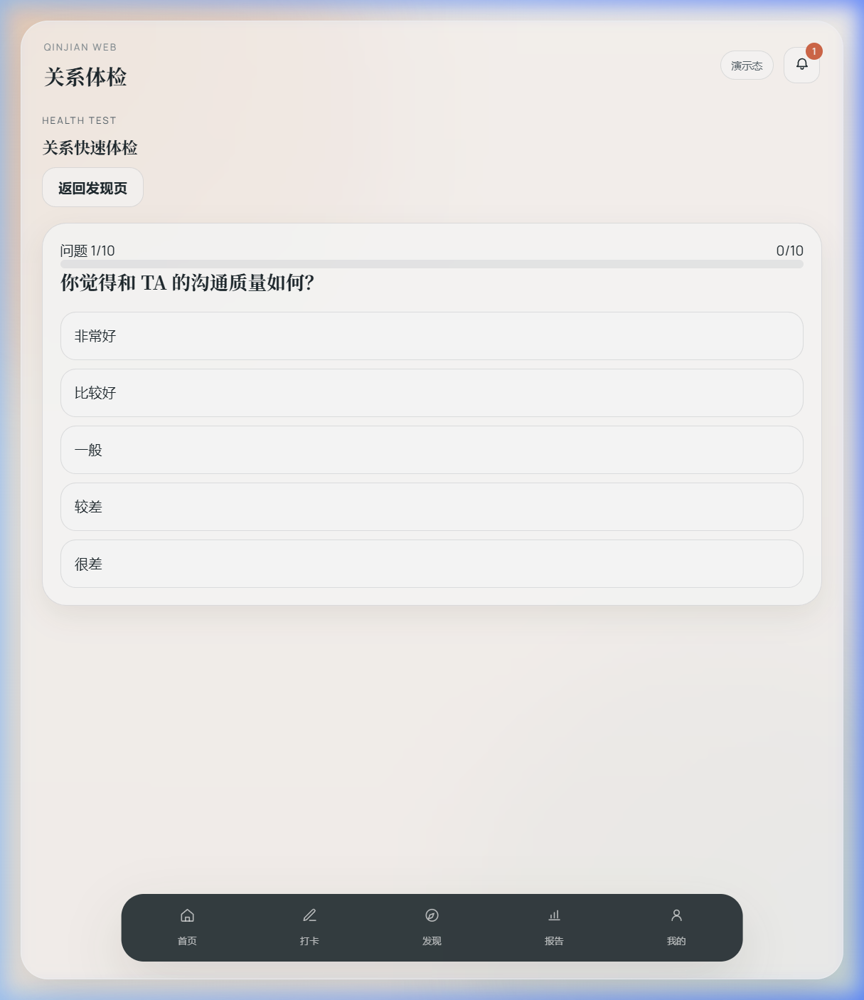

图 A-4 关系健康测试页

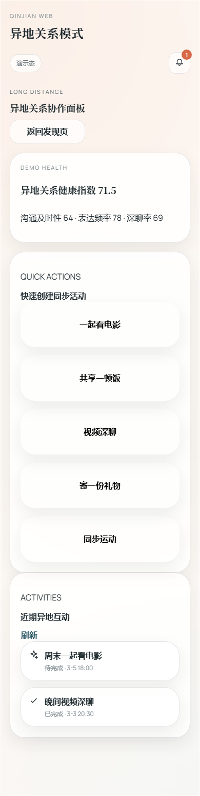

图 A-5 异地关系页

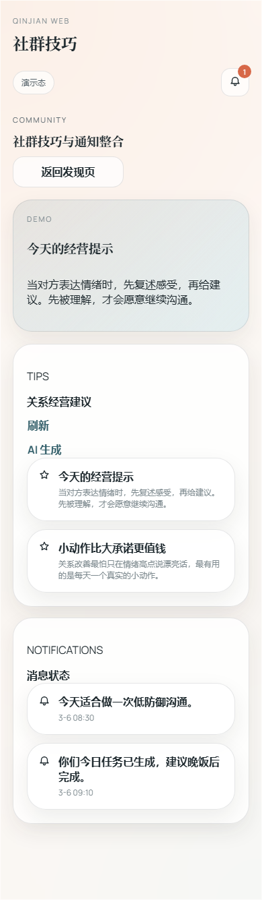

图 A-6 社区页

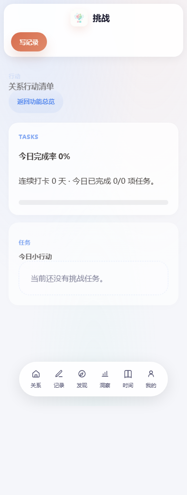

图 A-7 挑战赛页

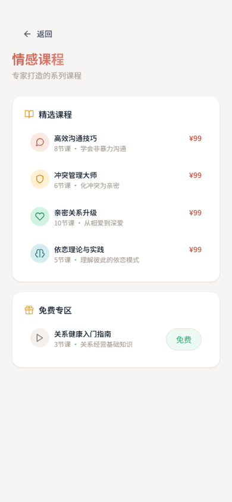

图 A-8 课程页

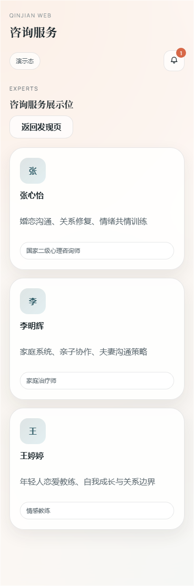

图 A-9 专家咨询页

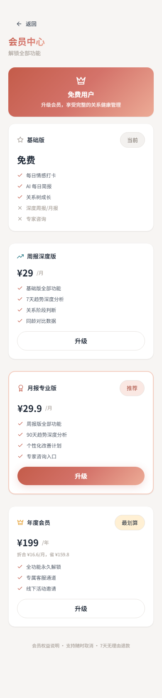

图 A-10 会员中心页

# 附录 B 建议补充的比赛材料

建议在最终提交版中进一步补充以下材料：

1. 学院与团队信息完整页；
2. 系统架构图；
3. 产品功能流程图；
4. 当前开发进度说明图；
5. 关键接口或模块说明图；
6. 实际测试记录或试用反馈；
7. 演示视频二维码；
8. 部署说明摘要；
9. 竞品分析简表；
10. 项目答辩讲解提纲。
