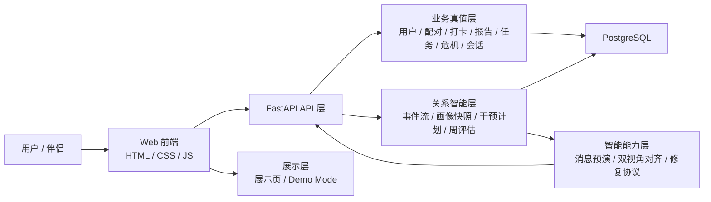

# 大学生计算机设计大赛作品说明书

## 一、作品名称

亲健——面向青年关系场景的关系支持系统

## 封面信息

- 作品编号：`【待填】`
- 作　　者：`【待填】`
- 版本编号：`V1.0`
- 填写日期：`2026-03-29`

## 二、赛道定位

- 推荐赛道：软件应用与开发 > Web应用与开发
- 作品核心是可访问、可演示、可部署的 Web 软件系统
- AI 作为系统能力的一部分参与消息预演、双视角对齐和修复协议生成，但不是作品唯一主体

## 三、作品概述

亲健是一个面向青年关系场景的关系支持系统，围绕情侣、夫妻、挚友等高频关系互动，提供记录、洞察、预演、修复、回看等能力。

它不是泛聊天机器人，也不是虚拟陪伴工具，而是一套把关系数据、关系状态和关系干预串成闭环的软件系统。

当前版本已具备公网访问、Demo Mode、关系总览、每日记录、关系简报、时间轴、个人中心和展示页等完整链路。

## 四、要解决的问题

当前关系类产品往往停留在三种形态：

- 记录型：能记，但难以形成判断和行动
- 内容型：能看文章，但很难贴合当前关系状态
- 聊天型：能回答问题，但缺少连续上下文和可解释依据

亲健希望解决的是：如何让系统在不替代人的前提下，持续理解关系状态、识别风险、给出更稳妥的下一步建议，并让这一切可解释、可追踪、可复盘。

## 五、核心功能

### 1. 今日记录

用户通过记录当天关系状态、互动体验和情绪变化，为后续分析提供输入。

### 2. 关系简报

系统对最近关系数据进行整理，生成可读的当前阶段判断。

### 3. 关系画像

将分散在打卡、报告、任务和风险事件中的信号沉淀为统一关系状态。

### 4. 消息预演

在真实沟通前，对一句话进行风险预演和更稳妥表达建议。

### 5. 双视角叙事对齐

整理双方最近同阶段的记录，帮助用户看到共同版本、错位点和桥接句。

### 6. 修复协议

在关系风险升高时，提供结构化、分步骤的修复建议。

### 7. 时间轴与证据抽屉

把关键关系节点沉淀为事件流，并展示“为什么记录、影响了什么、下一步建议从哪里来”。

### 8. 周评估与趋势

用正式周评估形成短期趋势，让项目具备持续观察能力。

### 9. 展示页

独立展示页用于比赛开场、功能总览和视觉样张展示，快速呈现产品气质、主路径和移动端布局。

## 六、页面结构与展示路径

当前系统页面包括：

- 登录 / 注册
- 关系绑定 / 等待加入
- 首页总览
- 每日记录
- 功能总览 / 展示页
- 关系简报
- 关系时间轴
- 个人中心
- 里程碑、异地关系、依恋分析、关系体检、社区、挑战、课程、专家咨询、会员方案

其中：

- 展示页负责快速呈现产品气质和主链路
- 首页负责回答“今天该做什么”
- 简报和时间轴负责核心闭环
- 个人中心负责账号、关系和边界信息

## 七、系统架构

作品采用 Web 前端、FastAPI 后端和 PostgreSQL 数据层构成主体架构，并在业务层之上增加关系智能层、智能能力层和面向答辩的展示层。

### 架构示意

### 给老师的人话版理解

如果不用技术术语，也可以把亲健理解成 5 层：

- 记录层：收集关系过程数据
- 评估层：形成关系状态判断
- 干预层：给出下一步行动建议
- 修复层：在冲突时提供结构化支持
- 回看层：把过程沉淀成时间轴和证据链

这 5 层共同组成了一个完整的软件闭环，因此项目重点不是“模型会不会说话”，而是系统能不能持续支持真实关系场景。

## 八、创新点

### 1. 完整闭环

项目不是“输入一句话，再输出一句建议”，而是形成了记录、评估、干预、修复和回看五个环节的完整链路。

### 2. 关系画像与状态共享

系统不是只保存原始记录，而是把分散在打卡、报告、任务和风险中的信号沉淀为统一关系状态，供多个模块共享。

### 3. 关系事件流与证据链

关键行为和判断都进入统一事件流，并通过证据抽屉解释当前节点为什么存在、影响哪些模块以及下一步建议是什么。

### 4. 行动化支持

系统不只告诉用户“有问题”，而是通过预演、对齐和修复协议把建议落到行动。

### 5. AI 补位而非替代

项目强调 AI 对真实关系的“补位”而非“替代”。系统会通过限制说明、风险边界、必要时转人工等设计，提醒用户回到现实沟通与现实支持，避免把产品误用为人际关系替身。

### 6. 长期跟踪能力

项目不仅生成一次判断，还通过周评估、事件流和时间轴记录关系变化轨迹，使后续建议建立在可持续追踪的证据上。

## 九、可解释性与边界

亲健高度重视系统解释性和使用边界。当前关键输出统一带：

- 证据摘要
- 限制说明
- 必要时转人工或暂停建议

因此项目定位于日常关系支持系统，而非专业诊断工具。

## 十、部署与演示

当前主展示端为 Web。

比赛建议使用三层演示方案：

- A 档：公网演示地址
- B 档：本机备用环境
- C 档：完整录屏视频

评委入口优先使用只读 Demo Mode（`?demo=1`），以保证样本稳定、演示链固定、每次刷新可恢复。

### 建议演示顺序

1. 先打开展示页，说明产品气质和主路径
2. 进入首页，展示关系总览
3. 完成今日记录
4. 生成关系简报
5. 打开时间轴与证据抽屉
6. 输入一句真实沟通内容，展示消息预演
7. 展示双视角叙事对齐
8. 展示修复协议
9. 回到展示页或个人中心，收束成完整闭环

## 十一、安装及使用

### 1. 安装环境要求

- 操作系统：Windows / Linux / macOS
- 后端环境：Python 3.x
- 数据库：PostgreSQL
- 部署方式：Docker Compose 或本地启动

### 2. 安装步骤

1. 获取源码并安装依赖
2. 配置数据库连接和环境变量
3. 启动后端服务
4. 打开前端页面或公网地址

### 3. 典型使用流程

1. 注册或登录账号
2. 完成关系绑定
3. 进入首页完成今日记录
4. 查看关系简报和关系时间轴
5. 使用消息预演或修复协议功能
6. 回到证据抽屉与历史记录进行复盘

### 4. 常见问题

- 如果页面无法访问，优先检查后端服务和数据库连接
- 如果数据未更新，先确认当前账号是否已完成关系绑定
- 如果演示模式异常，切换至本机备用环境或录屏视频

## 十二、参考文献

1. FastAPI 官方文档
2. PostgreSQL 官方文档
3. Mermaid 官方文档
4. Python 官方文档
5. 关系支持与心理学相关公开资料

## 十三、为什么适合软件赛道

亲健更适合软件赛道，而不是人工智能应用赛道，原因在于其最强优势是：

- 完整软件架构
- 真实访问入口
- 统一业务闭环
- 可解释证据链
- 稳定比赛演示能力

AI 在这里是系统能力的一部分，而不是唯一主体。

如果评委追问为什么不报人工智能应用，可以直接回答：项目当然用了 AI，但当前最成熟、最有竞争力的部分是完整软件系统和落地演示能力。按照赛道定义，亲健更符合“运行在 Web、网络和数据库之上的软件系统”这一类作品。

## 十四、当前完成度与后续升级

当前项目已经具备比赛演示所需的核心链路、解释面板、展示页、部署说明和比赛材料。下一轮升级会分成“主讲方向”和“储备方向”两层：

### 比赛主讲的 3 个方向

- 双盲反思与共识卡
- 主题式 5-7 天 Journey
- 关系仪式中心

### 先作为储备的方向

- 情感劳动平衡账本
- 关系气候预报

这些方向在当前阶段主要作为下一轮设计升级，不在答辩里冒充“已经全部实现”的能力。

后续升级重点将放在：

- 演示稳定性
- 视觉统一性
- 周评估趋势展示
- 策略审计的可视化解释
- 首页、展示页、报告页与时间轴的视觉节奏统一

而不会优先走重型多模态或平台扩展路线。
