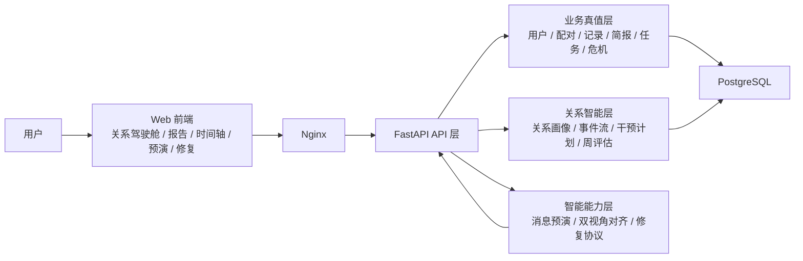

# 亲健系统架构图

## 架构说明

- 前端层：承载比赛演示主链路，重点页面是报告驾驶舱、时间轴和修复协议
- API 层：统一暴露关系智能接口，负责上下文组织和权限控制
- 业务真值层：存放用户、配对、记录、报告、任务和危机等原始业务数据
- 关系智能层：把分散信号沉淀为画像、事件流、周评估和干预计划
- 智能能力层：提供预演、对齐和修复等高感知能力

## 给老师的人话版 5 层理解

- `记录层`：今日记录、附件、里程碑等输入
- `评估层`：关系简报、关系画像、周评估趋势
- `干预层`：消息预演、任务建议、下一步行动方向
- `修复层`：双视角对齐、修复协议
- `回看层`：时间轴与证据抽屉

如果老师不想听技术名词，可以直接把亲健理解成一个“记录关系过程、形成状态判断、给出行动建议、支持冲突修复并且能够回看证据”的软件系统。

## 给评委的讲法

这张图要说明的重点不是“我们用了什么模型”，而是：亲健已经形成了一个完整的软件系统，智能能力是在统一架构里协同工作的。
