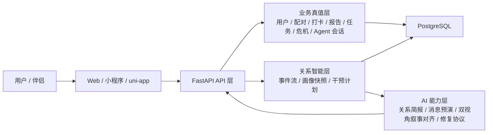
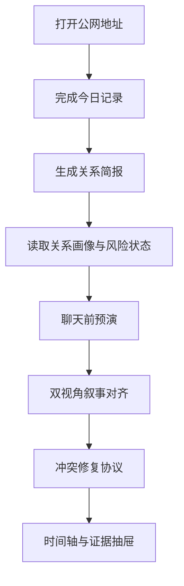

# 亲健：大学生计算机设计大赛软件应用与开发赛道答辩提纲

## 赛道定位

- 推荐大类：软件应用与开发
- 推荐小类：Web应用与开发
- 当前版本不主投人工智能应用
- 当前版本不参加教育智能体应用创新赛

## 推荐提交标题

亲健——面向青年关系场景的关系智能支持系统

## 一句话定位

亲健不是泛聊天机器人，也不是单点情感问答工具，而是一个运行在 Web / 服务端 / 数据库之上的关系智能支持系统。

它把“关系记录、关系洞察、关系干预、关系修复”串成了一条可持续、可追踪、可演示的闭环：

1. 用户记录当天状态
2. 系统生成关系洞察和风险判断
3. 系统给出下一步干预计划
4. 用户在真实沟通前可先做消息预演
5. 当风险升高时，系统提供结构化修复协议
6. 系统还能把双方同一天的记录整理成可直接沟通的“共同版本”

## 评委 15 秒内要看到什么

- 这是一个真实可访问的 Web 系统
- 它有清晰业务链，不是零散功能拼盘
- AI 是内嵌智能层，不是全部内容
- 系统能在真实关系场景里给出可执行支持

## 核心创新点

### 1. 关系画像引擎

系统不只保存原始打卡，而是将打卡、报告、任务、危机状态统一沉淀为关系画像。

价值：

- 把“碎片数据”变成“可持续理解”
- 不同模块共享同一套关系状态认知
- 为后续个性化干预和智能陪伴提供依据

### 2. 关系事件流

系统引入事件流机制，统一记录：

- `checkin.created`
- `report.completed`
- `task.completed`
- `crisis.raised`
- `message.simulated`
- `alignment.generated`
- `repair_protocol.requested`

价值：

- 支持时间序列分析
- 支持关系演化回放
- 支持后续做推荐效果评估与模型迭代

### 3. 干预计划系统

系统不只分析关系问题，而是基于关系画像自动生成干预计划。

例如：

- 低连接恢复计划
- 冲突修复计划
- 异地补偿计划
- 自我调节计划

价值：

- 从“告诉你有问题”升级成“告诉你怎么做”
- 体现软件设计中的决策逻辑和服务编排能力

### 4. 聊天前预演

用户输入一句准备发给伴侣的话，系统结合最近的关系画像，生成：

- 对方可能的第一感受
- 沟通升级风险
- 更安全的改写版本
- 建议做法与避免做法

价值：

- 将系统从事后分析推进到事前预防
- 属于高频、强感知、可演示的创新点

### 5. 冲突修复协议引擎

系统会根据当前风险等级自动生成不同层级的修复步骤：

- 平稳维护协议
- 轻度修复协议
- 中度结构化修复协议
- 严重冲突止损协议

价值：

- 从“风险提示”进化为“可执行流程”
- 非常适合答辩现场演示“软件如何介入真实关系场景”

### 6. 双视角叙事对齐

系统会读取双方最近同一阶段的记录，自动生成：

- 共同版本
- A / B 双方各自更在意的点
- 最容易产生误读的错位点
- 可直接拿来开口的桥接句

价值：

- 让系统不只会“分析关系”，还会“对齐双方叙事”
- 非常适合比赛现场展示“软件如何把抽象情绪翻译成可执行沟通”

## 系统架构亮点

### 前端层

- Web 工作台
- 微信小程序
- uni-app 客户端

### 后端层

- FastAPI
- PostgreSQL
- SQLAlchemy ORM
- Alembic 数据迁移

### 智能层

- AI 报告生成
- 关系画像生成
- 消息预演
- 双视角叙事对齐
- 修复协议编排
- 危机分级预警

### 数据层

- 原始业务表：用户、配对、打卡、报告、任务、危机、Agent 会话
- 关系智能表：关系事件、画像快照、干预计划

## 比赛答辩建议讲法

### 第一部分：为什么做

很多关系类产品停留在记录、聊天或内容分发层面，缺少真正可执行、可持续、可量化的关系干预能力。

亲健尝试解决的问题是：

“如何把青年关系场景中的情绪波动、沟通风险和修复行为，转化为一个可被软件持续支持的闭环系统？”

### 第二部分：为什么走软件赛道

- 项目本质是运行在 Web、服务端和数据库之上的完整软件系统
- 评委可以直接看到真实访问入口、业务闭环和多模块协同
- AI 在这里是系统能力的一层，不是单独拿出来讲的研究对象
- 当前最强优势是系统设计、落地完成度和现场演示效果

### 第三部分：我们做了什么

建议按下面顺序讲：

1. 多端记录入口
2. 关系简报与风险识别
3. 关系画像引擎
4. 关系事件流与时间轴
5. 干预计划与任务执行
6. 聊天前预演
7. 双视角叙事对齐
8. 冲突修复协议
9. 证据抽屉与策略审计

### 第四部分：为什么有技术含量

重点不要只说“我们接了大模型”，而要强调：

- 关系事件流设计
- 画像快照计算
- 风险分层规则
- 干预计划编排
- 多模块共享上下文
- 规则系统和 AI 能力结合
- 输入、分析、建议、回流组成完整闭环

### 第五部分：现场演示顺序

建议答辩时固定走这条链：

1. 打开公网 Web 地址，证明系统可真实访问
2. 进入首页，展示关系工作台
3. 完成一条今日记录
4. 生成关系简报
5. 展示关系画像和风险状态
6. 输入一句冲突消息，展示聊天前预演
7. 打开“双视角叙事对齐”，展示共同版本和错位点
8. 打开危机详情，展示修复协议步骤
9. 回到时间轴或证据抽屉，证明系统不是一次性生成，而是有持续记录和解释依据

这样一条链最完整，也最像“完整软件系统”而不是“页面集合”。

### 第六部分：提交材料锁定

- 公网可访问网址：对应 `Web应用与开发` 的赛道要求，评审时能直接打开
- 10 分钟以内演示视频：按“问题 -> 系统 -> 闭环 -> 智能能力”顺序录制
- 系统架构图：前端、后端、数据层、关系智能层、AI能力层一张图讲清
- 演示脚本：确保现场每一步都有输入、处理、输出和下一步动作
- 作品文档：至少写清应用场景、系统架构、核心功能、部署方式和使用说明

### 第七部分：高频追问

如果评委问“AI 创新在哪里？”  
回答重点不要落在“模型名字”上，而要落在“关系事件流、画像快照、策略编排、多模块共享上下文和可解释输出”上。要让评委看到，你们不是把 AI 挂在页面上，而是把 AI 放进了一套真正的软件闭环里。

如果评委问“为什么不报人工智能应用？”  
可以直接回答：项目当然用了 AI，但当前最强优势不是算法研究本身，而是完整软件系统、真实访问入口、业务闭环和落地演示能力。按照赛道说明，这样的作品投 `软件应用与开发 > Web应用与开发` 更贴合，也更能发挥项目已有优势。

## 当前阶段判断

- 当前答辩只讲已经形成的完整链路，不把未来多模态扩展当主轴
- 当前答辩只讲已经可演示的系统能力，不把模型训练和微调当卖点
- 当前材料只强调软件系统、业务闭环和智能能力嵌入，不讲泛平台化愿景

## 回应老师反馈：下一轮最值得补的方向

如果老师或评委认为当前链路仍然偏“树洞 + AI 输出”，建议把后续增强方向统一概括成下面三类，而不是零散加功能：

### 1. 双人协作能力

- 双盲反思
- 共识卡
- 双方共同完成的 Journey

### 2. 连续执行能力

- 每周关系检查
- 主题式 5-7 天 Journey
- 修复后复盘

### 3. 正向连接能力

- 关系仪式中心
- 感谢记录
- 微连接动作
- 异地同步与里程碑

这样项目就不再像“一个会分析的工具”，而更像“一个帮助双方持续经营关系的软件系统”。

## 可作为下一轮创新点储备的 5 个功能

1. 双盲反思与共识卡
2. 主题式关系 Journey
3. 关系仪式中心
4. 情感劳动平衡账本
5. 关系气候预报

## 评委最容易被打动的点

- 不只是记录，而是形成干预闭环
- 不只是总结，而是提前预防真实冲突
- 不只是给建议，而是能把双方叙事整理成共同版本
- 不只是风险提示，而是给出结构化修复步骤
- 有系统架构、有业务逻辑、有真实入口、有持续扩展空间
